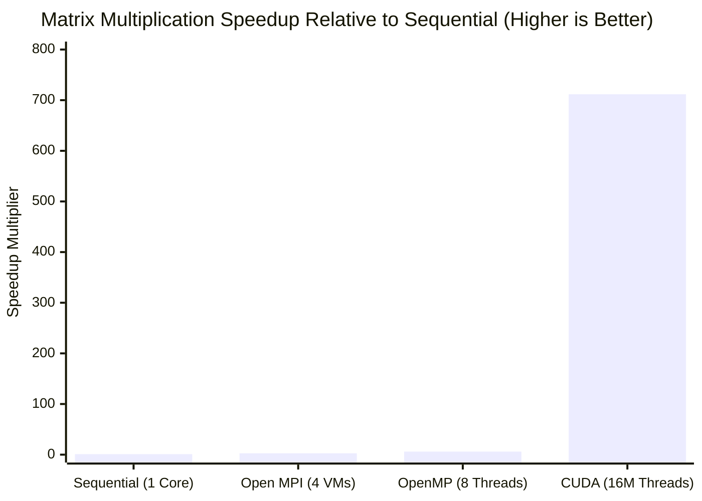

# Comparative Analysis of Dense Matrix Multiplication Paradigms

> **High-Performance Computing: Sequential vs. OpenMP vs. MPI vs. CUDA**  
> An empirical benchmark evaluating dense matrix multiplication ($4000 \times 4000$, 128 GFLOPs) across single-core CPU, multi-core shared memory, distributed cluster, and massively parallel GPU accelerator architectures.

---

## 1. Problem Formulation & Theoretical Foundations

Dense matrix multiplication $C = A \times B$ represents one of the most fundamental computational kernels in scientific computing, numerical simulations, and deep learning. Given two square matrices $A, B \in \mathbb{R}^{N \times N}$ with $N = 4000$:

$$C[i][j] = \sum_{k=0}^{N-1} A[i][k] \times B[k][j] \quad \text{for } 0 \le i, j < N$$

### Algorithmic & Hardware Complexity:
* **Computational Complexity**: $\mathcal{O}(N^3)$ operations. For $N = 4000$:
  $$\text{Total Operations} = 2 \times N^3 = 2 \times (4000)^3 = 128,000,000,000 \text{ FLOPs } (128 \text{ GFLOPs})$$
* **Memory Footprint**: Double-precision floating-point ($8 \text{ bytes/element}$):
  $$\text{Matrix Memory} = 4000 \times 4000 \times 8 \text{ bytes} \approx 128 \text{ MB per matrix} \implies \text{Total Heap Footprint} = 384 \text{ MB}$$
* **Mathematical Verification Invariant**:
  Matrices $A$ and $B$ are initialized to $1.0$:
  $$C[i][j] = \sum_{k=0}^{3999} (1.0 \times 1.0) = 4000.00$$
  Any valid parallel implementation must yield $C[0][0] = 4000.00$ and $C[N-1][N-1] = 4000.00$.

---

## 2. Benchmark Summary Matrix

| Implementation Paradigm | Architecture & Hardware Level | Execution Time | Speedup ($S$) | Parallel Efficiency ($E$) | GFLOPs Throughput | Verification Status |
| :--- | :--- | :--- | :--- | :--- | :--- | :--- |
| **Sequential CPU** | 1 Core (Single-Threaded Baseline) | **244.120000 s** | **1.00×** (Ref) | 100.0% | 0.524 GFLOPs | `C[0][0] = 4000.00` (PASS) |
| **MPI Cluster** | 4 Distributed Virtual Machines | **92.979510 s** | **2.63×** | 65.8% | 1.377 GFLOPs | `C[0][0] = 4000.00` (PASS) |
| **OpenMP Multi-Core** | 8 vCPU Cores (Shared Memory) | **40.545825 s** | **6.02×** | **75.3%** | 3.157 GFLOPs | `C[0][0] = 4000.00` (PASS) |
| **NVIDIA CUDA (Total)** | 16,000,000 GPU Threads (PCIe DMA) | **0.343020 s** | **711.68×** | — | 373.156 GFLOPs | `C[0][0] = 4000.00` (PASS) |
| **NVIDIA CUDA (Kernel)** | 16,000,000 GPU Threads (On-Chip) | **0.316872 s** | **770.40×** | — | 403.948 GFLOPs | `C[0][0] = 4000.00` (PASS) |

---

## 3. Experiments

### 1. Sequential Matrix Multiplication

A baseline matrix multiplication implementation using sequential CPU execution.

In this implementation, the complete matrix multiplication is performed by a single CPU process using three nested loops. Two 4000 × 4000 matrices are initialized with values of 1.0, and the result matrix is computed sequentially.

#### Compilation & Execution:
```bash
gcc -O2 matrix_sequential.c -o matrix_sequential
./matrix_sequential
```

#### Terminal Output Screenshot:


#### Architectural Analysis:
* **The Memory Stride Bottleneck**: In row-major C layout, accessing Matrix $B$ (`B[k * N + j]`) jumps by $4000 \times 8 = 32\text{ KB}$ on each iteration of loop $k$. Because modern CPU cache lines are 64 bytes, every access to $B$ results in a cache miss, stalling the execution pipeline on main memory DRAM latency.

[View Sequential Experiment](https://github.com/SoumyaSurpur/Parallel-and-GPU-Computing/blob/main/Sequential.md)

---

### 2. OpenMP Shared-Memory Multi-Threading

Parallelizes the outer loop across 8 CPU threads using `#pragma omp parallel for private(j, k) schedule(static)`.

A shared-memory parallel implementation using OpenMP and multiple CPU threads.

The matrix multiplication is parallelized using OpenMP, allowing multiple CPU threads to perform different parts of the computation concurrently. In this experiment, 8 OpenMP threads are used to process the 4000 × 4000 matrix.

#### Compilation & Execution:
```bash
export OMP_NUM_THREADS=8
gcc -O2 -fopenmp matrix_openmp.c -o matrix_openmp
./matrix_openmp
```
#### Terminal Output Screenshot:


#### Architectural Analysis:
* **High Parallel Efficiency (75.3%)**: OpenMP benefits from uniform shared memory. All 8 cores access Matrix $B$ through shared on-chip L3 cache with zero inter-process serialization.
* **Cache Line Isolation**: Static scheduling assigns 500 contiguous rows per thread, eliminating false sharing on output Matrix $C$.

[View OpenMP Experiment](https://github.com/SoumyaSurpur/Parallel-and-GPU-Computing/blob/main/OpenMP.md)

---

### 3. MPI Matrix Multiplication

A distributed-memory implementation using MPI across multiple processes and virtual machines.

#### Compilation & Execution:
```bash
mpicc -O2 matrix_mpi.c -o matrix_mpi
scp matrix_mpi worker1:~/matrix_mpi && scp matrix_mpi worker2:~/matrix_mpi && scp matrix_mpi worker3:~/matrix_mpi
mpirun -np 4 --hostfile hosts sh -c '$HOME/matrix_mpi'
```

#### Terminal Output Screenshot:


#### Architectural Analysis:
* **Network Communication Overhead ($T_{\text{comm}} / T_{\text{comp}}$)**: Scattering 1000 rows ($32\text{ MB}$) to each node and broadcasting the entire Matrix $B$ ($128\text{ MB}$) introduces TCP/IP packetization and socket serialization delays over virtualized network bridges.
* **Horizontal Scalability**: Slower than shared-memory OpenMP on a single physical machine, but unconstrained by motherboard memory limits, allowing scaling across thousands of nodes in high-performance clusters.

[View MPI Experiment](./MPI.md)

---

### 4. CUDA Matrix Multiplication

Maps computation to a 2D grid of thread blocks ($250 \times 250$ blocks, $16 \times 16$ threads per block = **16,000,000 active threads**), computing each cell concurrently.

#### Compilation & Execution:
```bash
nvcc -O2 matrix_cuda.cu -o matrix_cuda.exe
./matrix_cuda.exe
```

#### Terminal Output Screenshot:


#### Architectural Analysis:
* **Massive Thread-Level Parallelism**: 16 million threads hide global memory latency via SIMT (Single Instruction, Multiple Threads) warp scheduling.
* **Speedup Multiplier**:
  - Kernel Compute Phase: **$770.40\times$** ($0.316872\text{ s}$)
  - Full Host-Device Pipeline (with PCIe DMA transfer): **$711.68\times$** ($0.343020\text{ s}$)

[View CUDA Experiment](./CUDA.md)

---

## 4. Performance Graphs & Comparative Analysis



```text
Execution Time in Seconds (Lower is Better)
Sequential Baseline : [████████████████████████████████████████] 244.12 s (1.00x Baseline)
Open MPI (4 VMs)    : [███████████████                        ]  92.98 s (2.63x Speedup)
OpenMP (8 Cores)    : [██████                                ]  40.55 s (6.02x Speedup)
CUDA (GPU Phase)    : [▏                                     ]   0.34 s (711.68x Speedup)
```

---
## 5. Technologies Used

- C
- GCC
- Ubuntu
- WSL2
- OpenMP
- MPI
- CUDA

## 6. Directory Structure

```text
Parallel-and-GPU-Computing/
│
├── README.md
├── Sequential.md
├── OpenMP.md
├── MPI.md
└── CUDA.md
```
